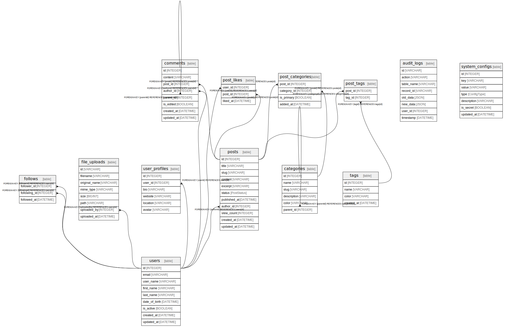

# Database Schema

## Description

Generated from Prisma schema using @prisma/generator-helper

## Viewpoints

| Name | Description |
| ---- | ----------- |
| [comments on post](viewpoint-0.md) | Users can comment on each post multiple times and put a star on each comment. |

## Tables

| Name | Columns | Comment | Type |
| ---- | ------- | ------- | ---- |
| [users](users.md) | 9 | User management with various constraints Stores user account information including authentication details | table |
| [user_profiles](user_profiles.md) | 6 | One-to-one relationship for extended user information Stores additional profile data not required for authentication | table |
| [categories](categories.md) | 6 | Content categorization system Hierarchical category structure for organizing posts | table |
| [posts](posts.md) | 11 | Blog post content management Supports drafts, publishing, and archiving with author attribution | table |
| [post_categories](post_categories.md) | 4 |  | table |
| [tags](tags.md) | 4 |  | table |
| [post_tags](post_tags.md) | 2 |  | table |
| [comments](comments.md) | 8 |  | table |
| [post_likes](post_likes.md) | 3 |  | table |
| [follows](follows.md) | 3 |  | table |
| [audit_logs](audit_logs.md) | 8 |  | table |
| [system_configs](system_configs.md) | 7 |  | table |
| [file_uploads](file_uploads.md) | 8 |  | table |

## Enums

| Name | Values |
| ---- | ------- |
| post_status | ARCHIVED, DELETED, DRAFT, PUBLISHED |
| config_type | BOOLEAN, JSON, NUMBER, STRING |

## Relations

---

> Generated by [tbls](https://github.com/k1LoW/tbls)
