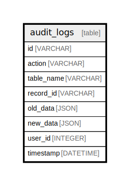

# audit_logs

## Description

## Columns

| Name | Type | Default | Nullable | Children | Parents | Comment |
| ---- | ---- | ------- | -------- | -------- | ------- | ------- |
| id | VARCHAR | cuid() | false |  |  |  |
| action | VARCHAR |  | false |  |  |  |
| table_name | VARCHAR |  | false |  |  |  |
| record_id | VARCHAR |  | false |  |  |  |
| old_data | JSON |  | true |  |  |  |
| new_data | JSON |  | true |  |  |  |
| user_id | INTEGER |  | true |  |  |  |
| timestamp | DATETIME | now() | false |  |  |  |

## Constraints

| Name | Type | Definition |
| ---- | ---- | ---------- |
| audit_logs_pkey | PRIMARY KEY | PRIMARY KEY (id) |

## Indexes

| Name | Definition |
| ---- | ---------- |
| audit_logs_id_idx | CREATE INDEX audit_logs_id_idx ON audit_logs (id) |
| audit_logs_table_name_record_id_idx | CREATE INDEX audit_logs_table_name_record_id_idx ON audit_logs (table_name, record_id) |
| audit_logs_user_id_timestamp_idx | CREATE INDEX audit_logs_user_id_timestamp_idx ON audit_logs (user_id, timestamp) |

## Relations

---

> Generated by [tbls](https://github.com/k1LoW/tbls)
