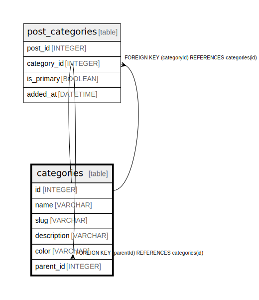

# categories

## Description

Content categorization system  
Hierarchical category structure for organizing posts

## Columns

| Name | Type | Default | Nullable | Children | Parents | Comment |
| ---- | ---- | ------- | -------- | -------- | ------- | ------- |
| id | INTEGER | autoincrement() | false | [categories](categories.md) [post_categories](post_categories.md) |  |  |
| name | VARCHAR |  | false |  |  |  |
| slug | VARCHAR |  | false |  |  |  |
| description | VARCHAR |  | true |  |  |  |
| color | VARCHAR |  | true |  |  |  |
| parent_id | INTEGER |  | true |  | [categories](categories.md) |  |

## Constraints

| Name | Type | Definition |
| ---- | ---- | ---------- |
| categories_pkey | PRIMARY KEY | PRIMARY KEY (id) |
| categories_name_unique | UNIQUE | UNIQUE (name) |
| categories_slug_unique | UNIQUE | UNIQUE (slug) |

## Relations

---

> Generated by [tbls](https://github.com/k1LoW/tbls)
