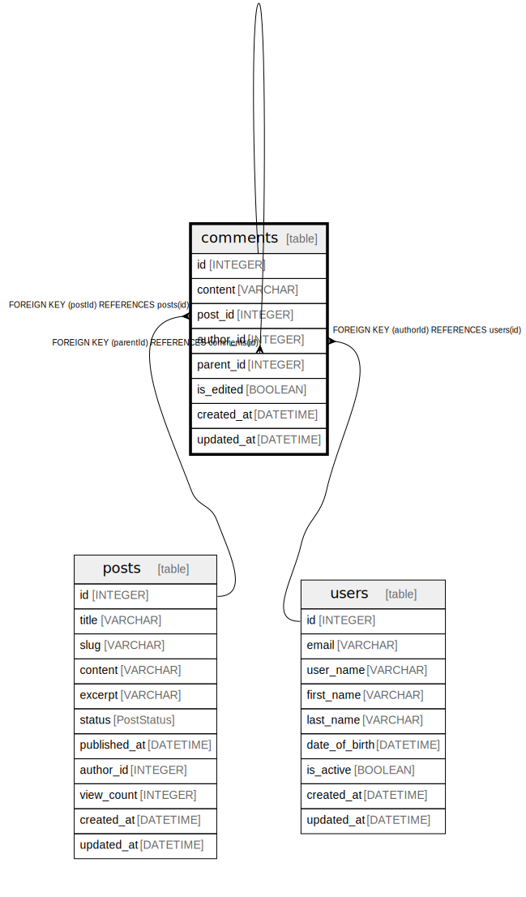

# comments

## Description

## Columns

| Name | Type | Default | Nullable | Children | Parents | Comment |
| ---- | ---- | ------- | -------- | -------- | ------- | ------- |
| id | INTEGER | autoincrement() | false | [comments](comments.md) |  |  |
| content | VARCHAR |  | false |  |  |  |
| post_id | INTEGER |  | false |  | [posts](posts.md) |  |
| author_id | INTEGER |  | false |  | [users](users.md) |  |
| parent_id | INTEGER |  | true |  | [comments](comments.md) |  |
| is_edited | BOOLEAN |  | false |  |  |  |
| created_at | DATETIME | now() | false |  |  |  |
| updated_at | DATETIME |  | false |  |  |  |

## Viewpoints

| Name | Definition |
| ---- | ---------- |
| [comments on post](viewpoint-0.md) | Users can comment on each post multiple times and put a star on each comment. |

## Constraints

| Name | Type | Definition |
| ---- | ---- | ---------- |
| comments_pkey | PRIMARY KEY | PRIMARY KEY (id) |

## Relations

---

> Generated by [tbls](https://github.com/k1LoW/tbls)
