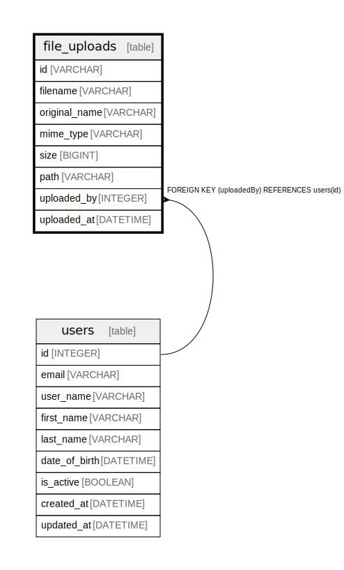

# file_uploads

## Description

## Columns

| Name | Type | Default | Nullable | Children | Parents | Comment |
| ---- | ---- | ------- | -------- | -------- | ------- | ------- |
| id | VARCHAR | cuid() | false |  |  |  |
| filename | VARCHAR |  | false |  |  |  |
| original_name | VARCHAR |  | false |  |  |  |
| mime_type | VARCHAR |  | false |  |  |  |
| size | BIGINT |  | false |  |  |  |
| path | VARCHAR |  | false |  |  |  |
| uploaded_by | INTEGER |  | false |  | [users](users.md) |  |
| uploaded_at | DATETIME | now() | false |  |  |  |

## Constraints

| Name | Type | Definition |
| ---- | ---- | ---------- |
| file_uploads_pkey | PRIMARY KEY | PRIMARY KEY (id) |

## Indexes

| Name | Definition |
| ---- | ---------- |
| file_uploads_id_idx | CREATE INDEX file_uploads_id_idx ON file_uploads (id) |
| file_uploads_mime_type_idx | CREATE INDEX file_uploads_mime_type_idx ON file_uploads (mime_type) |
| file_uploads_uploaded_by_uploaded_at_idx | CREATE INDEX file_uploads_uploaded_by_uploaded_at_idx ON file_uploads (uploaded_by, uploaded_at) |

## Relations

---

> Generated by [tbls](https://github.com/k1LoW/tbls)
