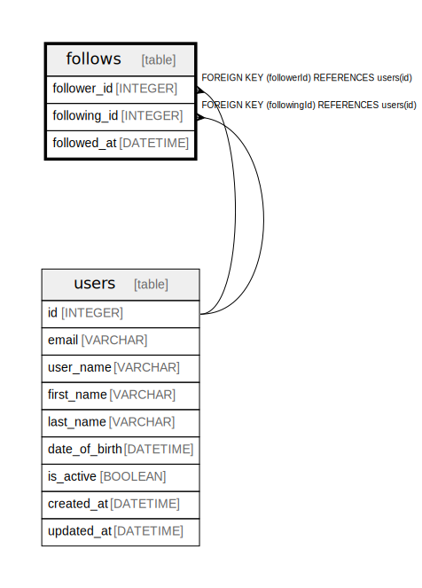

# follows

## Description

## Columns

| Name | Type | Default | Nullable | Children | Parents | Comment |
| ---- | ---- | ------- | -------- | -------- | ------- | ------- |
| follower_id | INTEGER |  | false |  | [users](users.md) |  |
| following_id | INTEGER |  | false |  | [users](users.md) |  |
| followed_at | DATETIME | now() | false |  |  |  |

## Constraints

| Name | Type | Definition |
| ---- | ---- | ---------- |
| follows_pkey | PRIMARY KEY | PRIMARY KEY (followerId, followingId) |
| follows_followerId_followingId_unique | UNIQUE | UNIQUE (followerId, followingId) |

## Indexes

| Name | Definition | Comment |
| ---- | ---------- | ------- |
| follows_follower_id_following_id_idx | CREATE INDEX follows_follower_id_following_id_idx ON follows (follower_id, following_id) |  |
| follows_follower_id_following_id_idx | CREATE INDEX follows_follower_id_following_id_idx ON follows (follower_id, following_id) | Unique index |

## Relations

---

> Generated by [tbls](https://github.com/k1LoW/tbls)
