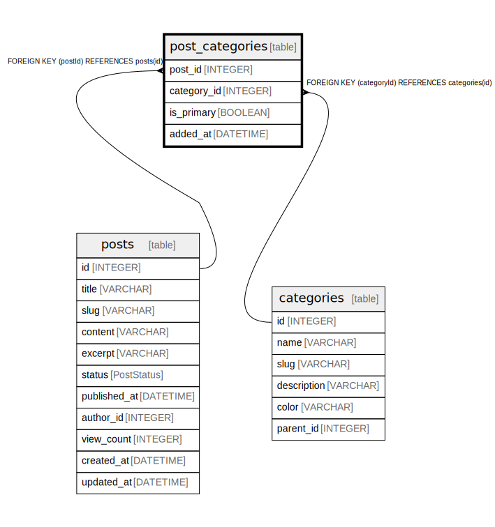

# post_categories

## Description

## Columns

| Name | Type | Default | Nullable | Children | Parents | Comment |
| ---- | ---- | ------- | -------- | -------- | ------- | ------- |
| post_id | INTEGER |  | false |  | [posts](posts.md) |  |
| category_id | INTEGER |  | false |  | [categories](categories.md) |  |
| is_primary | BOOLEAN |  | false |  |  |  |
| added_at | DATETIME | now() | false |  |  |  |

## Constraints

| Name | Type | Definition |
| ---- | ---- | ---------- |
| post_categories_pkey | PRIMARY KEY | PRIMARY KEY (postId, categoryId) |

## Relations

---

> Generated by [tbls](https://github.com/k1LoW/tbls)
