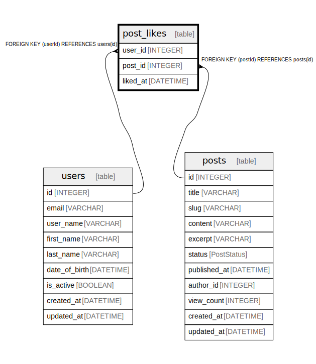

# post_likes

## Description

## Columns

| Name | Type | Default | Nullable | Children | Parents | Comment |
| ---- | ---- | ------- | -------- | -------- | ------- | ------- |
| user_id | INTEGER |  | false |  | [users](users.md) |  |
| post_id | INTEGER |  | false |  | [posts](posts.md) |  |
| liked_at | DATETIME | now() | false |  |  |  |

## Constraints

| Name | Type | Definition |
| ---- | ---- | ---------- |
| post_likes_pkey | PRIMARY KEY | PRIMARY KEY (userId, postId) |

## Relations

---

> Generated by [tbls](https://github.com/k1LoW/tbls)
