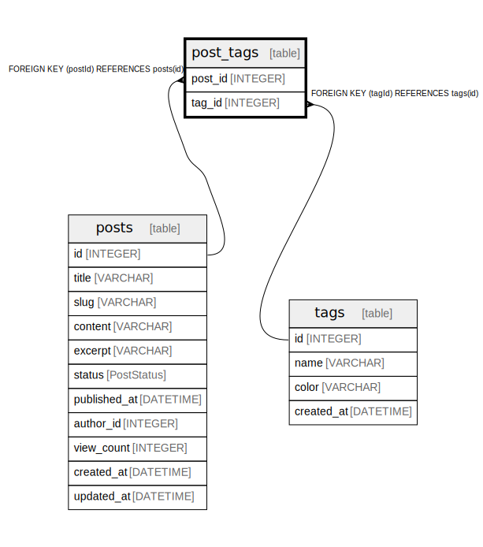

# post_tags

## Description

## Columns

| Name | Type | Default | Nullable | Children | Parents | Comment |
| ---- | ---- | ------- | -------- | -------- | ------- | ------- |
| post_id | INTEGER |  | false |  | [posts](posts.md) |  |
| tag_id | INTEGER |  | false |  | [tags](tags.md) |  |

## Constraints

| Name | Type | Definition |
| ---- | ---- | ---------- |
| post_tags_pkey | PRIMARY KEY | PRIMARY KEY (postId, tagId) |

## Indexes

| Name | Definition |
| ---- | ---------- |
| post_tags_post_id_tag_id_idx | CREATE INDEX post_tags_post_id_tag_id_idx ON post_tags (post_id, tag_id) |

## Relations

---

> Generated by [tbls](https://github.com/k1LoW/tbls)
