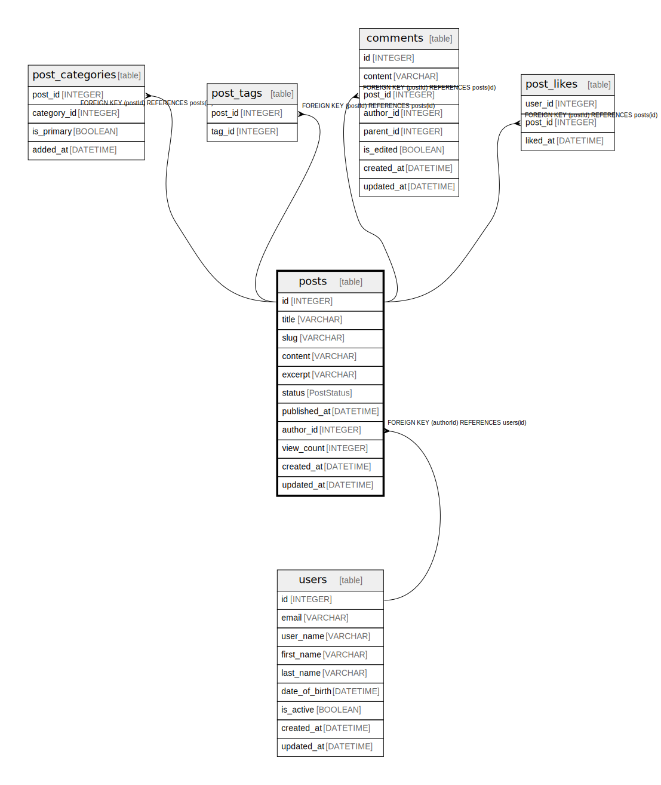

# posts

## Description

Blog post content management  
Supports drafts, publishing, and archiving with author attribution

## Columns

| Name | Type | Default | Nullable | Children | Parents | Comment |
| ---- | ---- | ------- | -------- | -------- | ------- | ------- |
| id | INTEGER | autoincrement() | false | [post_categories](post_categories.md) [post_tags](post_tags.md) [comments](comments.md) [post_likes](post_likes.md) |  | Unique post identifier |
| title | VARCHAR |  | false |  |  | Post title displayed in listings and detail view |
| slug | VARCHAR |  | false |  |  | URL-friendly post identifier for SEO |
| content | VARCHAR |  | true |  |  | Main post content in markdown format |
| excerpt | VARCHAR |  | true |  |  | Short summary for post previews |
| status | PostStatus | 'DRAFT' | false |  |  | Publication status for content workflow |
| published_at | DATETIME |  | true |  |  | Timestamp when post was published |
| author_id | INTEGER |  | false |  | [users](users.md) | Author reference for content attribution |
| view_count | INTEGER |  | false |  |  | Number of times post has been viewed |
| created_at | DATETIME | now() | false |  |  | Post creation timestamp |
| updated_at | DATETIME |  | false |  |  | Last modification timestamp |

## Viewpoints

| Name | Definition |
| ---- | ---------- |
| [comments on post](viewpoint-0.md) | Users can comment on each post multiple times and put a star on each comment. |

## Constraints

| Name | Type | Definition |
| ---- | ---- | ---------- |
| posts_pkey | PRIMARY KEY | PRIMARY KEY (id) |
| posts_slug_unique | UNIQUE | UNIQUE (slug) |

## Relations

---

> Generated by [tbls](https://github.com/k1LoW/tbls)
