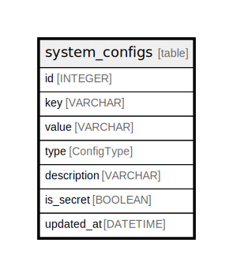

# system_configs

## Description

## Columns

| Name | Type | Default | Nullable | Children | Parents | Comment |
| ---- | ---- | ------- | -------- | -------- | ------- | ------- |
| id | INTEGER | autoincrement() | false |  |  |  |
| key | VARCHAR |  | false |  |  |  |
| value | VARCHAR |  | false |  |  |  |
| type | ConfigType |  | false |  |  |  |
| description | VARCHAR |  | true |  |  |  |
| is_secret | BOOLEAN |  | false |  |  |  |
| updated_at | DATETIME |  | false |  |  |  |

## Constraints

| Name | Type | Definition |
| ---- | ---- | ---------- |
| system_configs_pkey | PRIMARY KEY | PRIMARY KEY (id) |
| system_configs_key_unique | UNIQUE | UNIQUE (key) |

## Indexes

| Name | Definition | Comment |
| ---- | ---------- | ------- |
| system_configs_id_idx | CREATE INDEX system_configs_id_idx ON system_configs (id) |  |
| system_configs_key_idx | CREATE INDEX system_configs_key_idx ON system_configs (key) | Unique index |

## Relations

---

> Generated by [tbls](https://github.com/k1LoW/tbls)
