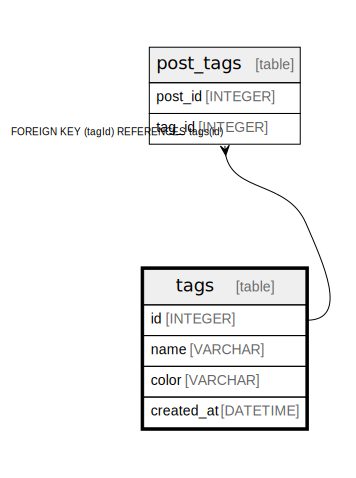

# tags

## Description

## Columns

| Name | Type | Default | Nullable | Children | Parents | Comment |
| ---- | ---- | ------- | -------- | -------- | ------- | ------- |
| id | INTEGER | autoincrement() | false | [post_tags](post_tags.md) |  |  |
| name | VARCHAR |  | false |  |  |  |
| color | VARCHAR |  | true |  |  |  |
| created_at | DATETIME | now() | false |  |  |  |

## Constraints

| Name | Type | Definition |
| ---- | ---- | ---------- |
| tags_pkey | PRIMARY KEY | PRIMARY KEY (id) |
| tags_name_unique | UNIQUE | UNIQUE (name) |

## Indexes

| Name | Definition | Comment |
| ---- | ---------- | ------- |
| tags_id_idx | CREATE INDEX tags_id_idx ON tags (id) |  |
| tags_name_idx | CREATE INDEX tags_name_idx ON tags (name) | Unique index |

## Relations

---

> Generated by [tbls](https://github.com/k1LoW/tbls)
