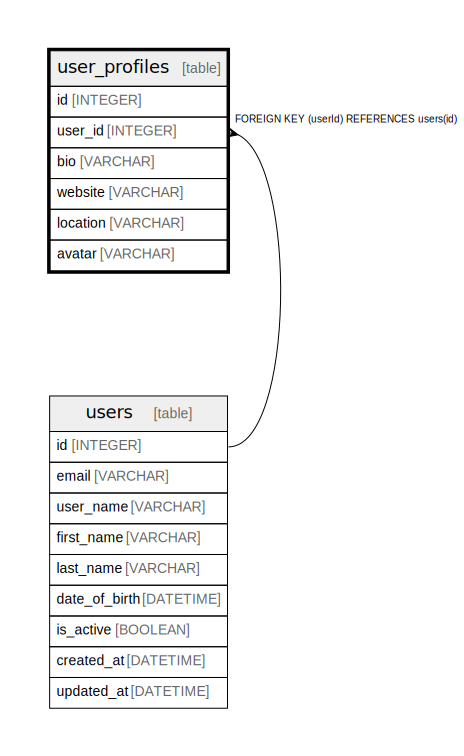

# user_profiles

## Description

One-to-one relationship for extended user information  
Stores additional profile data not required for authentication

## Columns

| Name | Type | Default | Nullable | Children | Parents | Comment |
| ---- | ---- | ------- | -------- | -------- | ------- | ------- |
| id | INTEGER | autoincrement() | false |  |  |  |
| user_id | INTEGER |  | false |  | [users](users.md) |  |
| bio | VARCHAR |  | true |  |  |  |
| website | VARCHAR |  | true |  |  |  |
| location | VARCHAR |  | true |  |  |  |
| avatar | VARCHAR |  | true |  |  |  |

## Constraints

| Name | Type | Definition |
| ---- | ---- | ---------- |
| user_profiles_pkey | PRIMARY KEY | PRIMARY KEY (id) |
| user_profiles_user_id_unique | UNIQUE | UNIQUE (user_id) |

## Relations

---

> Generated by [tbls](https://github.com/k1LoW/tbls)
