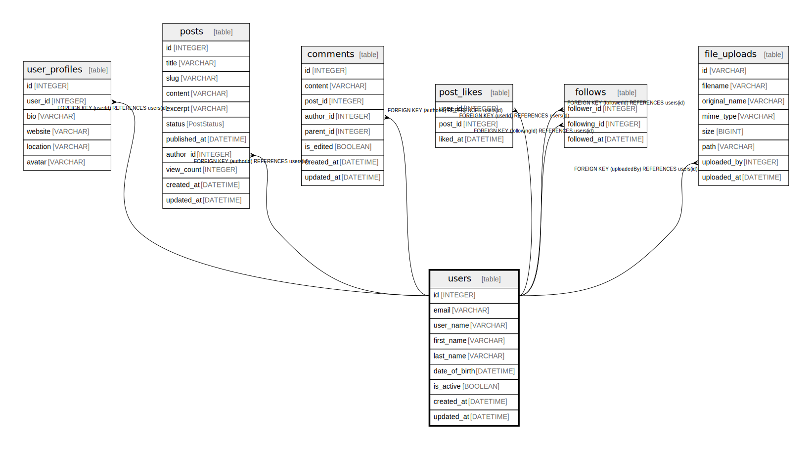

# users

## Description

User management with various constraints  
Stores user account information including authentication details

## Columns

| Name | Type | Default | Nullable | Children | Parents | Comment |
| ---- | ---- | ------- | -------- | -------- | ------- | ------- |
| id | INTEGER | autoincrement() | false | [user_profiles](user_profiles.md) [posts](posts.md) [comments](comments.md) [post_likes](post_likes.md) [follows](follows.md) [file_uploads](file_uploads.md) |  | Primary key for user identification |
| email | VARCHAR |  | false |  |  | User email address for login and notifications |
| user_name | VARCHAR |  | false |  |  | Display name visible to other users |
| first_name | VARCHAR |  | true |  |  | User's first name (optional) |
| last_name | VARCHAR |  | true |  |  | User's last name (optional) |
| date_of_birth | DATETIME |  | true |  |  | User's birth date for age verification |
| is_active | BOOLEAN | true | false |  |  | Account status flag for access control |
| created_at | DATETIME | now() | false |  |  | Account creation timestamp |
| updated_at | DATETIME |  | false |  |  | Last profile update timestamp |

## Viewpoints

| Name | Definition |
| ---- | ---------- |
| [comments on post](viewpoint-0.md) | Users can comment on each post multiple times and put a star on each comment. |

## Constraints

| Name | Type | Definition |
| ---- | ---- | ---------- |
| users_pkey | PRIMARY KEY | PRIMARY KEY (id) |
| users_email_unique | UNIQUE | UNIQUE (email) |
| users_user_name_unique | UNIQUE | UNIQUE (user_name) |
| users_firstName_lastName_unique | UNIQUE | UNIQUE (firstName, lastName) |

## Indexes

| Name | Definition | Comment |
| ---- | ---------- | ------- |
| users_id_idx | CREATE INDEX users_id_idx ON users (id) |  |
| users_email_idx | CREATE INDEX users_email_idx ON users (email) | Unique index |
| users_username_idx | CREATE INDEX users_username_idx ON users (username) | Unique index |
| users_email_is_active_idx | CREATE INDEX users_email_is_active_idx ON users (email, is_active) |  |
| users_first_name_last_name_idx | CREATE INDEX users_first_name_last_name_idx ON users (first_name, last_name) | Unique index |

## Relations

---

> Generated by [tbls](https://github.com/k1LoW/tbls)
