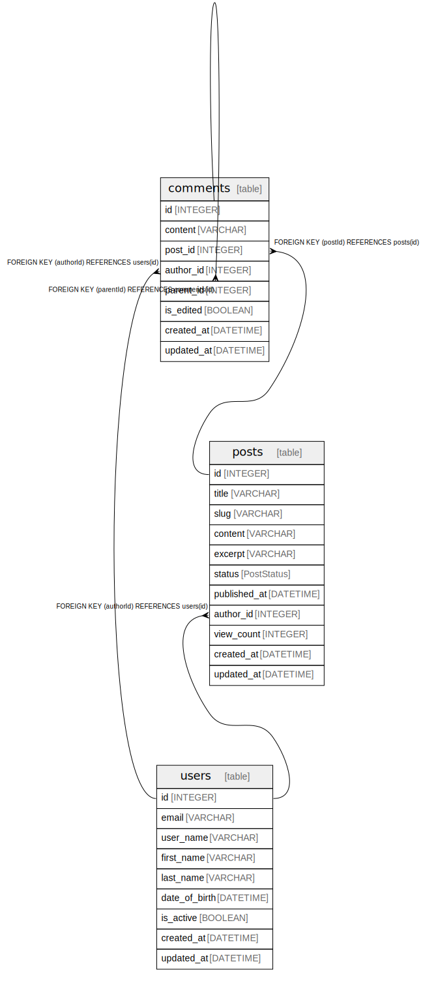

# comments on post

## Description

Users can comment on each post multiple times and put a star on each comment.

## Tables

| Name | Columns | Comment | Type |
| ---- | ------- | ------- | ---- |
| [users](users.md) | 9 | User management with various constraints Stores user account information including authentication details | table |
| [posts](posts.md) | 11 | Blog post content management Supports drafts, publishing, and archiving with author attribution | table |
| [comments](comments.md) | 8 |  | table |

## Relations

---

> Generated by [tbls](https://github.com/k1LoW/tbls)
